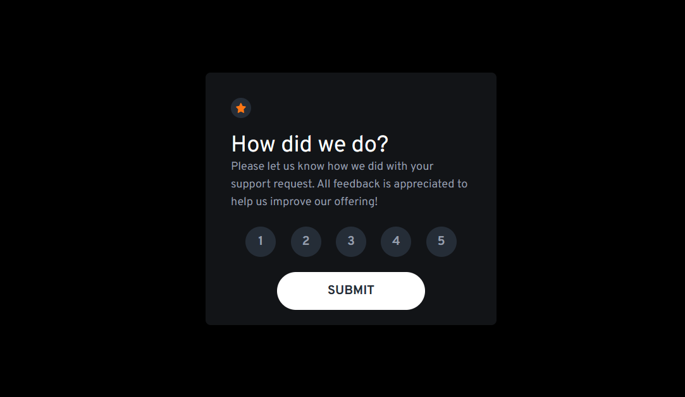
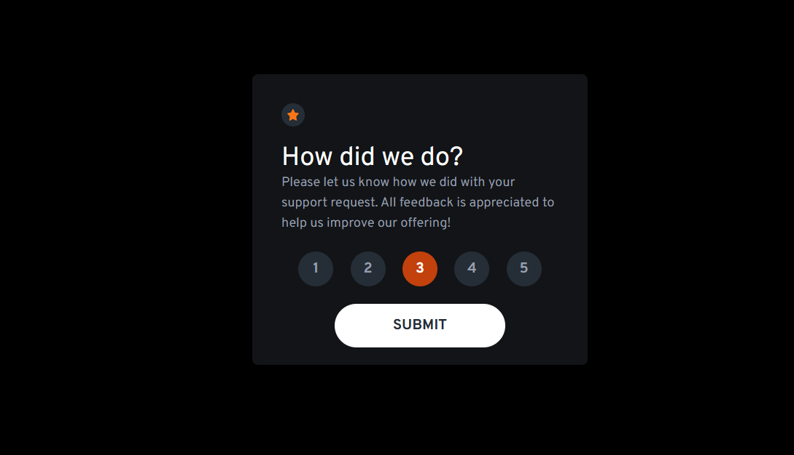
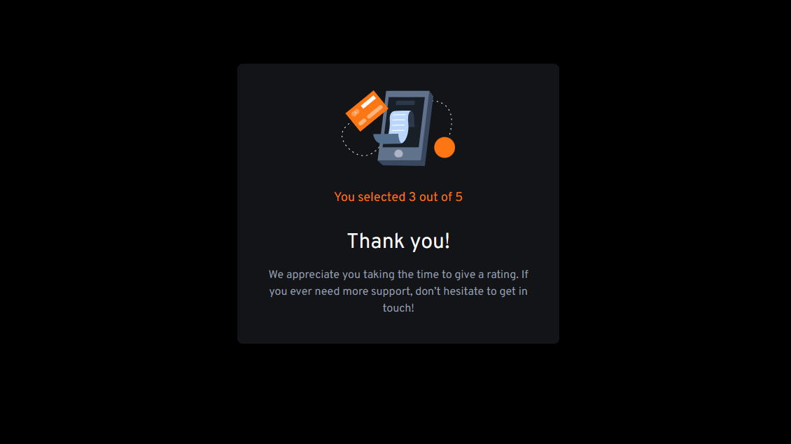
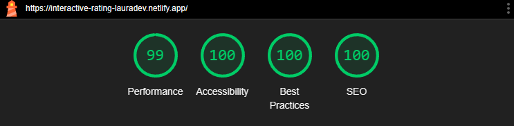

# Interactive Rating Component

This project entailed creating a Interactive Rating website with both mobile and web responsive designs. Key features include a TailwindCSS modern design,an interactive rating, and a thank you page which displays the end user's rating selection.

## Table of contents

- [Overview](#overview)
  - [The challenge](#the-challenge)
  - [Screenshots](#screenshots)
  - [Links](#links)
- [My process](#my-process)
  - [Built with](#built-with)
  - [What I learned](#what-i-learned)
  - [Continued development](#continued-development)
  - [Useful resources](#useful-resources)
- [Author](#author)

## Overview

This project involved replicating a design layout given for desktop and mobile for a Interactive Rating component with special features.

### The challenge

Users should be able to:

- View the optimal layout for the app depending on their device's screen size
- See hover states for all interactive elements on the page
- Select and submit a number rating
- See the "Thank you" card state after submitting a rating

### Screenshots

### Links

- Live Site URL: [Easybank Landing Page Laura Dev](https://interactive-rating-lauradev.netlify.app/)
- Github Repo: [Github Repo](https://github.com/lavollmer/interactive-rating-component)
- Solution URL: [Frontend Mentor Solution]()

### My Process

I began by setting up TailwindCSS, ReactJS, and my GitHub repository. Additionally, I configured the README template, added all design assets, integrated Google Fonts, and defined the color scheme. I ensured that all commits were successfully pushed to GitHub before beginning my project.

Next, I reviewed the design layout to determine which sections would be reusable components. In the App component, I created a CSS class that would apply to the entire screen to cover it with the selected background color and size. I created my application by starting with App.jsx and importing the Rating component where most of the application lives. In the rating component, I had two sections - one which would display all the information for the rating and the second (based on state management) would display the Thank You component. I created a reusable component called `ButtonCopy` for styling all the rating buttons. Another challenging aspect of this project was managing state and passing props throughout the application. I needed to track the user's selection and pass it to the Thank You component while also managing the submission state for TailwindCSS styling.

When the end user selects a number rating, it triggers a handleRatingClick which updates the isSubmitted state to set the rating to the number selected. Additionally, when the end user selects the submit button - it triggers a handleSubmit button which either says the end user needs to choose a rating or changes the setIsSubmitted to true that triggers the Thank You component to display in the Rating component. When the Thank You component displays, it shows the user's selected rating which is passed as a props rating.

Additionally, I updated the index.html with the Google Fonts link, a meta description and a new icon to display. I ran a Lighthouse report to show that I had 100s in SEO, Best Pratices, and accessibility. I had a 99 rating in performance which I was satisfied with.

Overall, this project challenged my knowledge of props management, useState management, tailwindCSS styling based on dynamic information and ReactJS component structure. I enjoyed working on this project and I think it turned out well!

After submitting my design to Frontend Mentor, I refined my design with specific details and color. I updated the background and button colors to match more closely to the design. Additionally, I elongated the SUBMIT button as well as made the background color orange. I spaced the rating number buttons from evenly to justify-between to have more space between them. Overall, these improvements added more asthetics to the design.

### Built with

- [React](https://reactjs.org/) - JS library
- TailwindCSS
- Vite
- Google Fonts
- Semantic HTML5 markup
- CSS custom properties
- Flexbox
- CSS Grid
- Mobile-first workflow

### What I learned

1. **_Conditional Rendering_** - I learned more about conditional rendering within an application. I wanted to render a new component when handleSubmit was selected with the Submit button. I imported the new component, created a state variable to track when the component should be rendered, updated the function to set the variable and conditionally rendered the new variable.
2. **_Custom Configuration_** - I wanted a custom size for the box styling of the rating component. I found that default values were either too large or too small for what I was trying to achieve. I added custom width values in the tailwind.config.js file and applied those custom classes in my containers.
3. **_TailwindCSS Styling Dynamic Rendering_** - I wanted the number buttons to change color when clicked by the end user. I used the ButtonCopy component and updated the TailwindCSS styling based on state management (passed as props to the component). I was able to change the button to orange when the end user would select the number button.
4. **_Lighthouse Report_** - I worked on creating an accessible website that would be 100s on the lighthouse report. I was excited to receive 100s in 3 categories and a 99 in performance. I worked on ensuring the website had alt tags for images, html structure was correct, SEO meta description and much more.

### Continued development

I want to continue learning about state and props management in ReactJS. I will do this be completing more projects and independent learning.

### Useful resources

- Google Fonts Overpass(https://fonts.google.com/specimen/Overpass)
- Render Blocking Resources(https://developer.chrome.com/docs/lighthouse/performance/render-blocking-resources/?utm_source=lighthouse&utm_medium=devtools)

## Author

- Frontend Mentor - [@lavollmer](https://www.frontendmentor.io/profile/lavollmer)
- Github - [@lavollmer](https://github.com/lavollmer)
- Website - [Laura Dev Portfolio Website](www.lauradeveloper.com)
